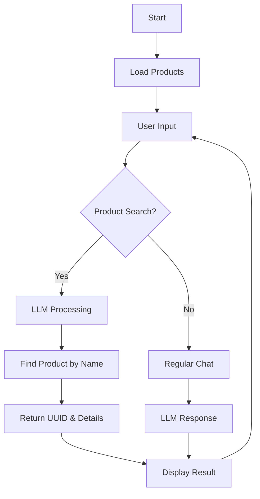

URL : https://fp00-5g9.pages.dev/

# Lofe-Coffee Chatbot System

## 📋 Deskripsi

Lofe-Coffee Chatbot System adalah aplikasi single page application (SPA) yang menggabungkan sistem manajemen produk dengan chatbot AI untuk coffee shop. Aplikasi ini memungkinkan pengelolaan produk dan interaksi pelanggan melalui chatbot yang dapat mencari produk berdasarkan nama dan mengembalikan UUID produk.

## 🎯 Tujuan

- **Manajemen Produk**: Menyediakan sistem untuk menambah, menghapus, dan mengelola produk coffee shop
- **AI Assistant**: Memberikan pengalaman pelanggan yang interaktif melalui chatbot AI
- **Product Discovery**: Membantu pelanggan menemukan produk dengan mudah melalui pencarian berbasis AI
- **UUID Tracking**: Setiap produk memiliki UUID unik untuk tracking dan identifikasi yang akurat
- **Real-time Interaction**: Memberikan respons real-time untuk pertanyaan pelanggan

## 🛠️ Tech Stack

### Frontend
- **HTML5**: Struktur aplikasi
- **CSS3**: Styling dengan custom CSS dan animasi
- **JavaScript (ES6+)**: Logic aplikasi dan interaksi
- **Tailwind CSS**: Framework CSS untuk styling responsif
- **jQuery**: Library JavaScript untuk manipulasi DOM
- **Bootstrap Icons**: Icon set untuk UI

### AI & Backend Integration
- **Google Gemini 2.0 Flash**: Model LLM utama untuk chatbot
- **Supabase**: Backend-as-a-Service untuk database dan API
- **Supabase Edge Functions**: Serverless functions untuk API endpoints

### Database
- **PostgreSQL**: Database utama melalui Supabase
- **Session Storage**: Penyimpanan sementara untuk data sesi

## 🤖 Model LLM: Google Gemini 2.0 Flash

### Peran dan Fungsi

**Gemini 2.0 Flash** berperan sebagai:

1. **Kasir Virtual (Elsa)**
   - Menyapa pelanggan dengan ramah
   - Memandu proses pemesanan
   - Memberikan informasi produk

2. **Product Search Engine**
   - Memproses input pelanggan dalam bahasa natural
   - Mencari produk berdasarkan nama atau deskripsi
   - Mengembalikan UUID produk yang sesuai

3. **Transaction Manager**
   - Membuat transaksi baru
   - Menambahkan item ke transaksi
   - Mengelola data pelanggan

4. **Function Calling**
   - Menggunakan function calling untuk berinteraksi dengan API
   - Memanggil fungsi `getProduk()`, `createTransaksi()`, `addItemToTransaksi()`
   - Memproses hasil function call dan memberikan respons yang user-friendly

### Konfigurasi Model

```javascript
const GEMINI_API_URL = 'https://generativelanguage.googleapis.com/v1beta/models/gemini-2.0-flash:generateContent';
```

**Capabilities:**
- **Natural Language Processing**: Memahami input pelanggan dalam bahasa Indonesia
- **Context Awareness**: Mempertahankan konteks percakapan
- **Function Calling**: Dapat memanggil fungsi eksternal
- **Structured Output**: Memberikan respons yang terstruktur dan mudah dibaca

## 📁 Struktur File

```
├── index9.html          # Main application file (SPA)
├── README.md           # Dokumentasi proyek
└── assets/
    ├── javascript.svg  # JavaScript logo
    └── vite.svg       # Vite logo
```

## 🚀 Fitur Utama

### 1. Product Management
- ✅ Tambah produk dengan nama dan harga
- ✅ Generate UUID otomatis untuk setiap produk
- ✅ Hapus produk individual atau semua produk
- ✅ Display produk dalam format yang user-friendly
- ✅ Statistik real-time (total produk, total nilai)

### 2. AI Chatbot Integration
- ✅ Chat interface yang responsif
- ✅ Typing indicator untuk UX yang lebih baik
- ✅ Context-aware conversation
- ✅ Product search berdasarkan nama
- ✅ UUID retrieval untuk produk yang ditemukan

### 3. Session Management
- ✅ Session UUID untuk tracking
- ✅ Persistent chat history
- ✅ Resume session capability
- ✅ Customer data storage

### 4. Transaction System
- ✅ Create new transactions
- ✅ Add items to transactions
- ✅ Transaction tracking dengan UUID
- ✅ Order summary dan details

## 🔧 Instalasi dan Setup

### Prerequisites
- Web browser modern (Chrome, Firefox, Safari, Edge)
- Koneksi internet untuk CDN dependencies
- API keys untuk Gemini dan Supabase

### Setup

1. **Clone atau download file**
   ```bash
   # Download index9.html ke direktori lokal
   ```

2. **Konfigurasi API Keys**
   ```javascript
   // Update di dalam file index9.html
   const GEMINI_API_KEY = 'YOUR_GEMINI_API_KEY';
   const SUPABASE_URL = 'YOUR_SUPABASE_URL';
   const SUPABASE_ANON_KEY = 'YOUR_SUPABASE_ANON_KEY';
   ```

3. **Jalankan aplikasi**
   ```bash
   # Buka index9.html di web browser
   # Atau gunakan local server
   python -m http.server 8000
   # Akses http://localhost:8000/index9.html
   ```

## 📖 Cara Penggunaan

### 1. Menambah Produk
1. Isi nama produk dan harga
2. Klik "Tambah Produk"
3. Produk akan muncul di daftar dengan UUID unik

### 2. Menggunakan Chatbot
1. Klik "Pesanan Baru" untuk memulai sesi
2. Chat dengan Elsa (AI assistant)
3. Sebutkan nama produk untuk mendapatkan UUID
4. Ikuti instruksi untuk membuat transaksi

### 3. Mencari Produk
```
User: "Saya mau laptop gaming"
Elsa: "✅ Produk ditemukan!
📦 Laptop Gaming ASUS ROG
💰 Harga: Rp 15.000.000
🔑 UUID: a1b2c3d4-e5f6-7890-abcd-ef1234567890"
```

## 🔄 Flow Aplikasi



## 🧪 Testing

### Test Cases
1. **Product Addition**: Tambah produk dan verifikasi UUID generation
2. **Product Search**: Cari produk dengan nama parsial
3. **Chat Functionality**: Test respons AI untuk berbagai input
4. **Session Management**: Test resume session dan data persistence
5. **Transaction Flow**: Test create transaction dan add items

### Sample Test Data
```javascript
// Data produk contoh yang sudah tersedia
const sampleProducts = [
    { name: 'Laptop Gaming ASUS ROG', price: 15000000 },
    { name: 'Mouse Wireless Logitech', price: 350000 },
    { name: 'Keyboard Mechanical RGB', price: 750000 },
    { name: 'Monitor 4K Samsung', price: 4500000 },
    { name: 'Headset Gaming HyperX', price: 1200000 }
];
```

## 🔐 Security Considerations

- API keys disimpan di client-side (untuk demo purposes)
- Implementasi production harus menggunakan environment variables
- Session data menggunakan browser's sessionStorage
- Input validation untuk mencegah XSS

## 🚀 Deployment

### Local Development
```bash
# Serve dengan Python
python -m http.server 8000

# Atau dengan Node.js
npx serve .

# Atau dengan PHP
php -S localhost:8000
```

### Production Deployment
- Deploy ke static hosting (Netlify, Vercel, GitHub Pages)
- Konfigurasi environment variables untuk API keys
- Setup HTTPS untuk security

## 🤝 Contributing

1. Fork the project
2. Create feature branch (`git checkout -b feature/AmazingFeature`)
3. Commit changes (`git commit -m 'Add some AmazingFeature'`)
4. Push to branch (`git push origin feature/AmazingFeature`)
5. Open Pull Request

## 📝 License

Distributed under the MIT License. See `LICENSE` for more information.

## 👥 Team

- **Developer**: [Your Name]
- **AI Model**: Google Gemini 2.0 Flash
- **Backend**: Supabase
- **Frontend**: Vanilla JavaScript + Tailwind CSS

## 📞 Support

Untuk pertanyaan atau dukungan:
- Email: support@lofe-coffee.com
- GitHub Issues: [Create Issue](https://github.com/your-repo/issues)

---

**Made with ❤️ for Lofe-Coffee**